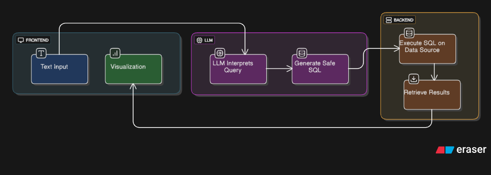

# LLM-Based Data Analyst Assistant

An AI-powered data analysis tool that lets you query Excel/CSV files and MySQL databases using natural language in any language. Get insights, visualizations, and SQL queries through a simple chat interface.

## 🚀 Features

- **Multilingual Support**: Ask questions in any language (Hindi, Spanish, French, etc.) and get responses in the same language
- **Dual Database Support**: Work with MySQL databases or upload Excel/CSV files
- **Smart Visualizations**: Automatic chart generation with insights
- **Natural Language to SQL**: Convert questions to SQL queries automatically
- **Existing Table Access**: Connect to MySQL and use existing tables instantly
- **File Upload**: Upload Excel/CSV files for analysis
- **Interactive Web Interface**: Clean Streamlit-based UI

## 📋 Prerequisites

1. **Python 3.8+**
2. **Ollama with Llama3 model**:
   ```bash
   # Install Ollama
   curl -fsSL https://ollama.ai/install.sh | sh
   
   # Pull Llama3 model
   ollama pull llama3
   
   # Start Ollama server
   ollama serve
   ```
3. **MySQL (optional)**: For database connectivity

## 🛠️ Installation

1. **Clone the repository**:
   ```bash
   git clone <repository-url>
   cd llm-data-analyst
   ```

2. **Install dependencies**:
   ```bash
   pip install -r requirements.txt
   ```

3. **Start the application**:
   ```bash
   streamlit run web_interface.py
   ```

4. **Open your browser**: Navigate to `http://localhost:8501`

## 🎯 Usage

### Option 1: MySQL Database Mode
1. Enter MySQL credentials in the sidebar
2. Click "Connect to MySQL"
3. View existing tables in the dropdown
4. Ask questions about your data

### Option 2: File-Only Mode
1. Click "Work with Files Only" or just upload files
2. Upload Excel/CSV files
3. Enter table names for your files
4. Click "Load" for each file
5. Ask questions about your data

## 💬 Example Questions

**English**:
- "What are the top 5 products by sales?"
- "Show me revenue by region"
- "Which customers bought the most?"

**Hindi**:
- "सबसे ज्यादा बिकने वाले उत्पाद कौन से हैं?"
- "क्षेत्रवार आय दिखाएं"

**Spanish**:
- "¿Cuáles son los productos más vendidos?"
- "Muestra los ingresos por región"

**PIE-CHART**:what is the distribution of sales by region
**line-GRAPH**:- "सबसे ज्यादा बिकने वाले उत्पाद कौन से हैं?"


## 🏗️ Architecture


## 📁 Project Structure

```
llm-data-analyst/
├── web_interface.py          # Main Streamlit app
├── data_analyst_mysql.py     # Core analysis engine
├── enhanced_visualizer.py    # Chart generation
├── requirements.txt          # Dependencies
└── README.md                # This file
```

## 🔧 Configuration

- **Ollama URL**: Default `http://localhost:11434`
- **MySQL Settings**: Host, Port, Username, Password, Database
- **File Upload**: Supports .xlsx, .xls, .csv formats

## 🌍 Supported Languages

- English, Hindi, Spanish, French, German, Italian, Portuguese, Russian, Chinese, Japanese, Korean, Arabic, and many more
- Automatic language detection and translation
- Responses in the same language as input

## Demo
[Watch the demo video](assets/DRAKO_VIDEO.mp4)


## Presentation Link
[Project Presentation](https://docs.google.com/presentation/d/1cMD-XJwSxvThHUMHSbJxzkLTeGa6Fmhk/edit?usp=sharing&ouid=108710103930304955505&rtpof=true&sd=true)


## 🤝 Contributing

1. Fork the repository
2. Create a feature branch
3. Make your changes
4. Submit a pull request


##COMMANDS TO RUN
ollama --version     ##to check ollama version

ollama pull llama3   ## to install ollama

ollama pull llama2

python setup_mysql.py ##to setup mysql

pip install -r requirements.txt   ##Install all dependencies

streamlit run web_interface.py     ## run the project on streamlit

